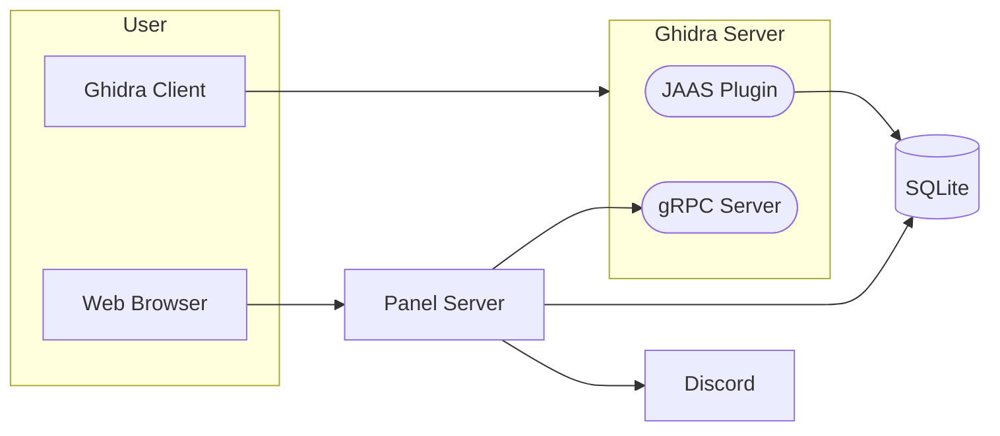

# Ghidra Community Panel

The Ghidra community panel assists with collaborative reverse engineering. It features:

- A self-service portal to allow users to create an account and request access to repositories
- A web interface for repository administrators to manage user access

This repository is not an official Ghidra project.

## Design

`ghidra-panel` introduces the following components:

- [SQLite database] storing hashed user credentials
- [JAAS plugin] implementing a Ghidra authentication provider
- [gRPC server] providing an API for the panel to interact with Ghidra
- Web server, written in [Go]
- Discord OAuth2 integration to authenticate users,
  and link Ghidra usernames to Discord usernames
  - Discord was chosen because all RE communities I've worked with use it
  - I'm open to adding OAuth 2.0 / OpenID Connect to support other SSO providers

[SQLite database]: https://www.sqlite.org/index.html
[JAAS plugin]: https://docs.oracle.com/javase/8/docs/technotes/guides/security/jaas/JAASRefGuide.html
[gRPC server]: https://grpc.io/
[Go]: https://go.dev/
[Discord OAuth2]: https://discord.com/developers/docs/topics/oauth2

## Philosophy

This software serves a hobbyist community with limited time.
As such, it aims to be simple, reproducible, and easy to maintain.

This rules out extensive use of external software, such as libraries,
database servers, auth servers, etc. Any such software would require
continuous updating.

This further means:
- No fancy IdP or access controls
  - [Keycloak](https://www.keycloak.org/) looked promising, but
    its JAAS adapter is [deprecated](https://www.keycloak.org/docs/22.0.1/securing_apps/#keycloak-java-adapters)
- A Go-based web server is a safe choice, as the standard library
  contains almost everything we need
- Web pages rendered server-side

## Acknowledgements

This panel currently powers [decomp.dev](https://decomp.dev), a shared space for GC/Wii decompilation projects.

Special thank you to the [mkw.re](https://github.com/mkw-re) contributors for creating the [original project](https://github.com/mkw-re/ghidra-panel).
